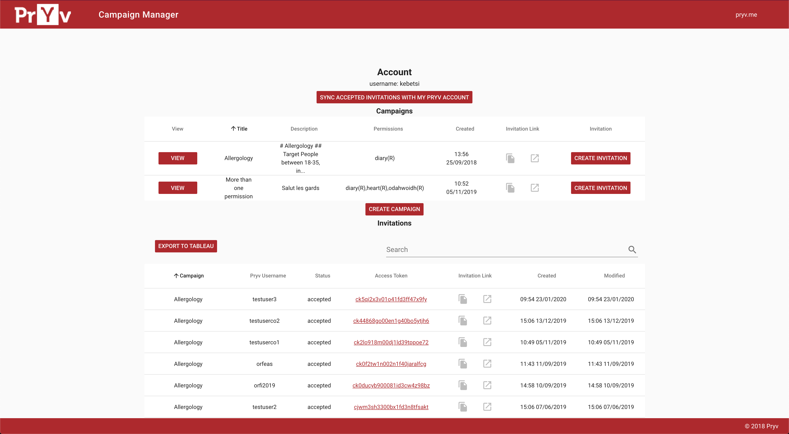
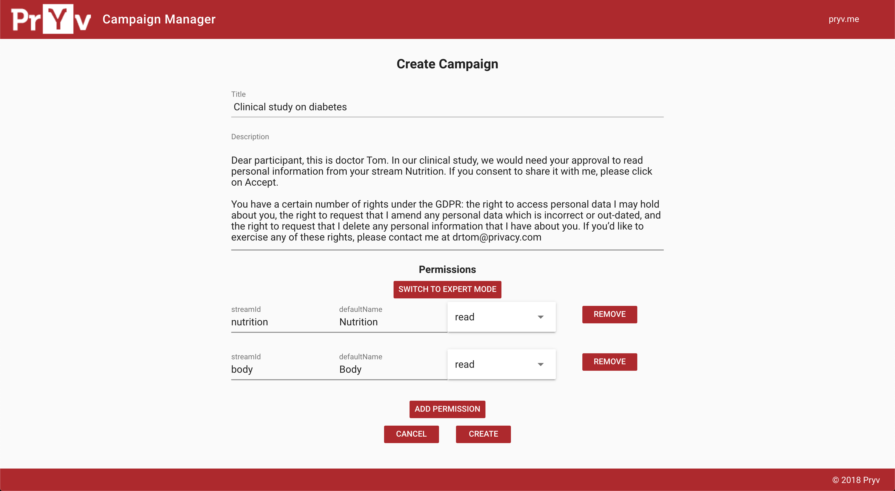
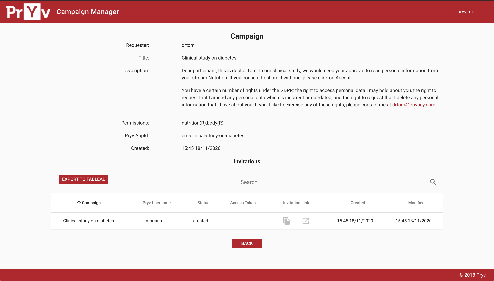

# Campaign manager (frontend)

Vue.js app for Pryv campaign management: [camp.pryv.me](https://camp.pryv.me); paired with its [backend Express.js app](https://github.com/pryv/poc-campaign-manager-backend).

## App

This app allows to build campaigns to collect accesses for patient data.

### Account view

On the account view, one can browse the campaigns he has created and the obtained accesses.

### Create campaign view

Here, the user can add a description to define the usage of the collected data and the requested streams.

### Display campaign view

Once a campaign is created, it displays its data, and the patients who have [given their consent](https://api.pryv.com/guides/consent/).

## Usage

*Prerequisites*: Node v8+, Yarn v1+

- Download dependencies: `yarn install`

- Serve with hot reload at localhost:8080: `yarn dev`

- Build for production with minification: `yarn build`

- Build for production and view the bundle analyzer report: `yarn build --report`

## Deploy to GH-pages

1. Build: `yarn build`
2. Make links relative (Remove first `/` from links in `gh-pages/index.html`, usually `/static/...` => `static/...`)
3. Commit and push

### Known issues

- When you have the following error: `Error: getaddrinfo ENOTFOUND http://localhost` upon launching the server with `yarn dev` or `yarn build`, define a new hostname pointing to `127.0.0.1` in your `/etc/hosts` file and add the `--host NEW_HOSTNAME` option in your script as it is done in the `dev2` script.  
